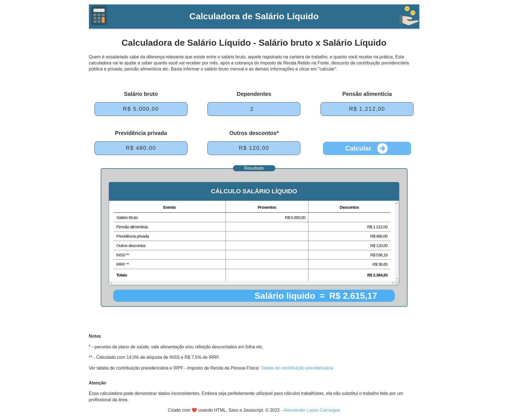

# Calculadora de Salário Líquido - Salário bruto x Salário Líquido

Sabe o valor do salário bruto e quer saber qual o salário líquido que cairá na conta, após as deduções com Imposto de Renda (IRPF), contribuição previdenciária obrigatória (INSS), pensão, vales, etc.? Faças as contas usando esta calculadora.

- *Atenção*: essa calculadora pode demonstrar dados inconsistentes. Embora seja perfeitamente utilizável para cálculos trabalhistas, ela não substitui o trabalho feito por um profissional da área.

## View Project in Execution

You can check this website on this [link](https://calculadora-salario-liquido.netlify.app).

## Technologies

- HTML5
- Sass
- JavaScript

## Prerequisites

You need a modern browser, just clone the repository, open the index.html
and edit it as you like. After edit share with me your version. :happy:

## License

Copyright (c) 2022 - **Alexsander Lopes Camargos**

Permission is hereby granted, free of charge, to any person obtaining a
copy of this software and associated documentation files (the "Software"),
to deal in the Software without restriction, including without limitation
the rights to use, copy, modify, merge, publish, distribute, sublicense,
and/or sell copies of the Software, and to permit persons to whom the
Software is furnished to do so, subject to the following conditions:

The above copyright notice and this permission notice shall be included in
all copies or substantial portions of the Software.

THE SOFTWARE IS PROVIDED "AS IS", WITHOUT WARRANTY OF ANY KIND, EXPRESS OR
IMPLIED, INCLUDING BUT NOT LIMITED TO THE WARRANTIES OF MERCHANTABILITY,
FITNESS FOR A PARTICULAR PURPOSE AND NONINFRINGEMENT. IN NO EVENT SHALL THE
AUTHORS OR COPYRIGHT HOLDERS BE LIABLE FOR ANY CLAIM, DAMAGES OR OTHER
LIABILITY, WHETHER IN AN ACTION OF CONTRACT, TORT OR OTHERWISE, ARISING
FROM, OUT OF OR IN CONNECTION WITH THE SOFTWARE OR THE USE OR OTHER
DEALINGS IN THE SOFTWARE.
